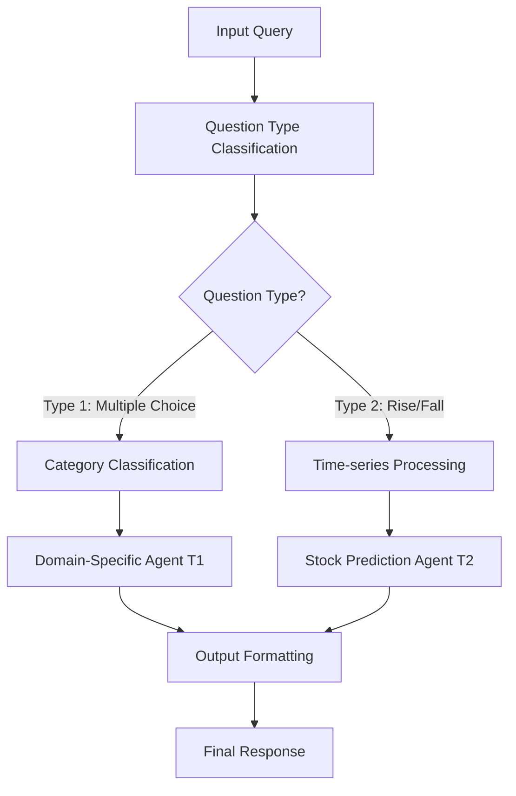

# Financial Analysis Agent - Hackathon Submission

## 🏆 Competition Overview

This project was developed for the **Financial Analysis Agent Hackathon**, focusing on creating an intelligent financial analysis system that leverages large language models (LLMs) and agentic workflows to comprehend complex financial contexts, investment strategies, and economic principles.

## 🎯 Project Description

Our Financial Analysis Agent is designed to:

- **Comprehend Financial Contexts**: Process and analyze complex financial data and scenarios
- **Investment Strategy Analysis**: Provide insights on investment decisions and portfolio management
- **Economic Principle Application**: Apply established economic theories and principles
- **Ethical Decision-Making**: Ensure all financial recommendations adhere to ethical standards
- **Multi-Language Support**: Handle both English and Thai financial queries

## 🏗️ Architecture Overview

The system employs a sophisticated multi-stage workflow built with **n8n** that processes financial queries through several specialized agents:

### Core Components

1. **Question Classifier (T1/T2)** - `Classifier_T1_T2.js`

   - Identifies question types (Multiple Choice vs. Rise/Fall predictions)
   - Preprocesses time-series data for stock predictions
   - Supports both English and Thai language inputs

2. **Category Classifier** - `Classify_category.js`

   - Categorizes questions into 11 CFA curriculum domains:
     - Ethics and Professional Standards
     - Quantitative Methods
     - Economic Analysis and Market Forces
     - Financial Reporting and Analysis
     - Corporate Finance and Issuers
     - Equity Investments
     - Fixed Income Investments
     - Derivative Instruments
     - Alternative Investments
     - Portfolio Management
     - Unclassified (General Knowledge)

3. **Specialized Agents**

   - **T1 Agent**: Handles multiple-choice questions with domain-specific prompting
   - **T2 Agent**: Focuses on stock price prediction (Rise/Fall) with technical analysis

4. **Output Formatter** - `Format_output.js`
   - Standardizes responses into consistent JSON format
   - Handles error cases and malformed outputs

## 🔧 Technical Implementation

### Workflow Architecture (`financial_analysis_workflow.json`)

The n8n workflow orchestrates the following process:



### Key Features

- **Multi-Modal Processing**: Handles both structured (time-series) and unstructured (text) data
- **Domain Expertise**: Specialized prompting based on CFA curriculum categories
- **Ethical Framework**: Built-in ethical guidelines for financial recommendations
- **Performance Optimization**: Designed for speed and accuracy balance
- **Error Handling**: Robust error management and fallback mechanisms

## 🚀 Getting Started

### Prerequisites

- **n8n** workflow automation platform
- **Ollama** or compatible LLM provider
- Node.js runtime for custom JavaScript functions

### Installation

1. Clone the repository:

```bash
git clone <repository-url>
cd financial_analysis_agent
```

2. Import the n8n workflow:

   - Open n8n interface
   - Import `financial_analysis_workflow.json`
   - Configure your preferred LLM provider and models

3. Set up model credentials:
   - Configure LLM API credentials in n8n
   - Ensure your chosen models are available and accessible

### Usage

#### API Endpoint

Send POST requests to the workflow webhook with the following format:

```json
{
  "question": "Your financial analysis question here..."
}
```

#### Example Queries

**Multiple Choice Question:**

```json
{
  "question": "Which of the following best describes portfolio diversification? A) Investing in one sector B) Spreading investments across different assets C) Focusing on high-risk investments D) Avoiding international markets"
}
```

**Stock Prediction:**

```json
{
  "question": "Based on the following data, will the stock price rise or fall tomorrow?\nContext: Date,Close,Volume\n2024-01-01,100.50,1000000\n2024-01-02,102.30,1200000\n2024-01-03,101.80,1100000"
}
```

#### Response Format

```json
{
  "answer": "B",
  "raw_output": "Portfolio diversification involves spreading investments across different asset classes, sectors, and geographic regions to reduce risk. This strategy helps minimize the impact of poor performance in any single investment on the overall portfolio."
}
```

## 🏅 Hackathon Compliance

### Rules Adherence

- ✅ **Open Source Models Only**: Compatible with any open-source LLM
- ✅ **Dataset Citations**: All datasets properly cited (see References section)
- ✅ **Custom System Prompts**: Enhanced predefined prompts for domain-specific expertise
- ✅ **Ethical Standards**: Built-in ethical decision-making framework

### Evaluation Criteria Optimization

- **Weighted Accuracy**: Multi-stage validation and domain-specific expertise
- **Speed**: Optimized workflow with parallel processing where possible
- **Model Size Efficiency**: Flexible architecture supports various model sizes

## 📊 Model Performance

### Evaluation Metrics

- **Accuracy**: Weighted accuracy across different question types
- **Speed**: Response time optimization
- **Model Efficiency**: Smaller models with strong performance receive bonus points

### Supported Models

- **Flexible Architecture**: Compatible with any open-source LLM
- **Recommended**: Typhoon2 series, Llama models, or similar performance models
- **Platform Support**: Ollama, Hugging Face, or custom API endpoints

## 📁 File Structure

```
financial_analysis_agent/
├── README.md                           # Project documentation
├── financial_analysis_workflow.json    # n8n workflow definition
├── Classifier_T1_T2.js                # Question type classification
├── Classify_category.js               # CFA domain categorization
├── Format_output.js                   # Response formatting
└── Screenshot 2025-06-28 at 4.53.21 PM.png  # Workflow visualization
```

## 🔍 Algorithm Details

### Question Classification

The system uses keyword matching and pattern recognition to classify questions into two main types:

- **Type 1**: Multiple choice questions requiring domain expertise
- **Type 2**: Stock price prediction requiring time-series analysis

### Domain-Specific Prompting

Each CFA curriculum category has specialized prompting strategies:

- **Mermaid diagrams** for step-by-step analysis workflows
- **Domain-specific validation rules**
- **Conservative decision-making for ambiguous cases**

### Time-Series Analysis

For stock predictions, the system:

- Extracts closing prices from CSV data
- Calculates percentage changes and trends
- Generates summary statistics for AI analysis
- Applies technical analysis principles

## 🛡️ Ethical Framework

The system incorporates robust ethical guidelines:

- **Fiduciary Duty**: Prioritizes client interests
- **Transparency**: Clear reasoning for all recommendations
- **Conservative Approach**: Chooses safer options when uncertain
- **Regulatory Compliance**: Adheres to financial industry standards

## 📚 References

### Datasets and Sources

- CFA Institute Curriculum Guidelines
- Financial market data standards
- Thai financial terminology references

### Model Citations

- Open-source LLM Models: Various providers (Ollama, Hugging Face, etc.)
- n8n Workflow Platform: Open-source workflow automation

## 🤝 Contributing

This project was developed for hackathon submission. For questions or collaboration opportunities, please reach out to the development team.

## 📄 License

This project is developed for educational and competition purposes. Please respect the hackathon terms and conditions.

---

**Developed for Financial Analysis Agent Hackathon 2025**
